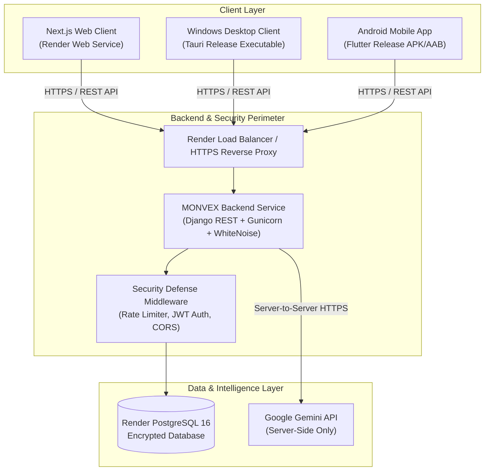
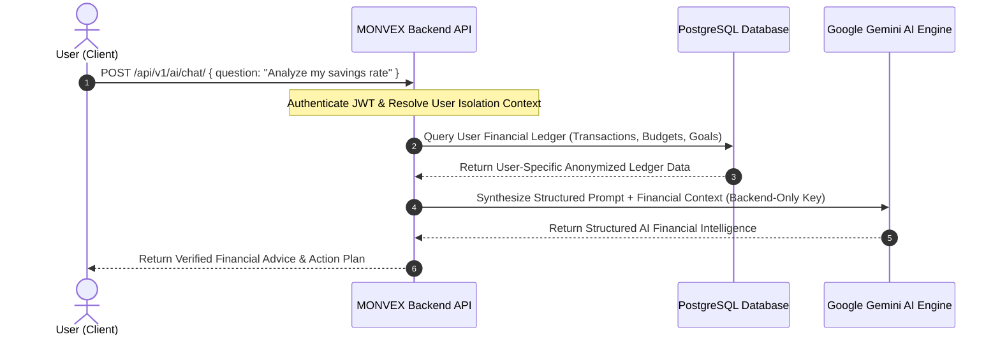

# MONVEX Production Deployment Architecture Specification

**Version:** 2.0.0  
**Target Cloud:** Render (Managed Web Services & PostgreSQL)  
**Client Distribution:** Web (Next.js SSR/Standalone), Windows (Tauri Desktop App), Android (Flutter Mobile Release)

---

## 1. High-Level Architecture Overview

MONVEX is designed as a unified, zero-trust financial intelligence ecosystem. All three client applications (Web, Windows Desktop, and Android Mobile) communicate strictly with the single central MONVEX REST & AI Backend, which mediates access to the production PostgreSQL database and Gemini LLM.

---

## 2. Platform Infrastructure & Service Breakdown

| Service Name | Service Type | Runtime / Tech Stack | Root Directory | Build Command | Start Command |
| :--- | :--- | :--- | :--- | :--- | :--- |
| **`monvex-backend`** | Render Web Service | Python 3.12 (Django 5.0, DRF) | `backend/` | `pip install -r requirements.txt && python manage.py collectstatic --no-input && python manage.py migrate` | `gunicorn monvex.wsgi:application --bind 0.0.0.0:$PORT` |
| **`monvex-web`** | Render Web Service | Node.js 20 LTS (Next.js 14) | `web/` | `npm install && npm run build` | `npm start` |
| **`monvex-db`** | Render PostgreSQL | PostgreSQL 16 (Managed) | N/A | Automated managed provisioning | Managed connection string (`DATABASE_URL`) |

---

## 3. Communication & Data Flow Specifications

### 3.1 Web Client Flow
$$\text{Web Browser} \xrightarrow{\text{HTTPS / JSON}} \text{Next.js / Rewrite Proxy} \xrightarrow{\text{Private / Public HTTPS}} \text{Django Backend} \xrightarrow{\text{SQL}} \text{PostgreSQL 16}$$

### 3.2 Windows Desktop Flow
$$\text{Tauri Desktop App} \xrightarrow{\text{Direct HTTPS REST}} \text{https://api.monvex.app/api/v1/} \xrightarrow{} \text{Django Backend} \xrightarrow{} \text{PostgreSQL 16}$$

### 3.3 Android Mobile Flow
$$\text{Flutter Mobile APK} \xrightarrow{\text{Direct HTTPS REST}} \text{https://api.monvex.app/api/v1/} \xrightarrow{} \text{Django Backend} \xrightarrow{} \text{PostgreSQL 16}$$

### 3.4 AI Copilot & Financial Intelligence Flow

> [!IMPORTANT]
> **No client (Web, Windows, or Android) ever connects directly to Google Gemini.** The `GEMINI_API_KEY` is strictly held on the server in `monvex-backend`.

---

## 4. Security & CORS Architecture

### 4.1 CORS Enforcement
- **Allowed Web Origins:** `https://monvex-web.onrender.com`, `https://app.monvex.ai`, `http://localhost:3000`, `tauri://localhost`
- **Native Clients:** Windows Tauri and Android Flutter utilize native HTTP sockets and do not enforce browser CORS restrictions.
- **Production Headers:** `X-Frame-Options: DENY`, `Strict-Transport-Security (HSTS)`, `X-Content-Type-Options: nosniff`.

### 4.2 User Isolation & Database Integrity
- Every SQL query is filtered by `user=request.user`.
- Foreign key cascading and indexed user lookups ensure 100% tenant data separation.
- Numeric monetary amounts utilize `DecimalField(max_digits=12, decimal_places=2)`.

---

## 5. Google OAuth 2.0 Architecture

- **Web Client ID:** `1068232450695-drbp5fk2066qtl9j83s69kkgk1gbc984.apps.googleusercontent.com`
- **Authorized JavaScript Origins:**
  - `https://monvex-web.onrender.com`
  - `https://app.monvex.ai`
  - `http://localhost:3000`
- **Authorized Redirect URIs:**
  - `https://monvex-web.onrender.com/login`
  - `https://monvex-web.onrender.com/api/auth/callback/google`
  - `http://localhost:3000/login`
- **Backend Verification Flow:**
  Client passes Google credential ID token to `/api/v1/auth/google/`. The backend verifies token signature against Google's public keys, retrieves authenticated user email, matches or creates the Django user, and issues standard rotating SimpleJWT tokens.

---

## 6. Step-by-Step Production Deployment Procedure

1. **Provision Database:** Create `monvex-db` (PostgreSQL 16) on Render.
2. **Deploy Backend Service (`monvex-backend`):**
   - Connect GitHub repository. Set Root Directory to `backend`.
   - Set Build Command: `pip install -r requirements.txt && python manage.py collectstatic --no-input && python manage.py migrate`
   - Set Start Command: `gunicorn monvex.wsgi:application --bind 0.0.0.0:$PORT`
   - Inject environment variables: `DATABASE_URL`, `SECRET_KEY`, `DEBUG=False`, `GEMINI_API_KEY`, `GOOGLE_CLIENT_ID`, `GOOGLE_CLIENT_SECRET`.
3. **Verify Backend Health:** Check `https://monvex-backend.onrender.com/health/` (returns `HTTP 200 {"status": "healthy"}`).
4. **Deploy Web Service (`monvex-web`):**
   - Connect GitHub repository. Set Root Directory to `web`.
   - Set Build Command: `npm install && npm run build`
   - Set Start Command: `npm start`
   - Inject environment variables: `NEXT_PUBLIC_API_URL`, `NEXT_PUBLIC_GOOGLE_CLIENT_ID`, `BACKEND_INTERNAL_URL`.
5. **Configure Production Origins:** Update backend `CORS_ALLOWED_ORIGINS` with the provisioned Web URL.
6. **Compile Native Release Binaries:**
   - **Windows:** Compile installer `MONVEX-Setup.exe` configured with production API URL.
   - **Android:** Compile release APK `monvex.apk` with `EnvConfig.activeMode = 'production'`.
