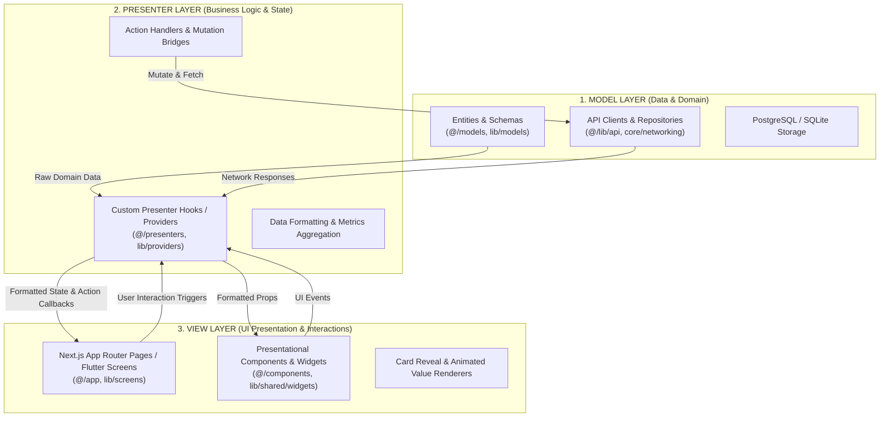

# MONVEX Codebase Architecture: Model-View-Presenter (MVP) Specification

**Version**: V4.1  
**Architecture Pattern**: Model-View-Presenter (MVP)  
**Target Platforms**: Web (Next.js/React), Mobile (Flutter/Dart), Desktop (Tauri/Windows)

---

## 1. Executive Architecture Overview

MONVEX enforces a strict **Model-View-Presenter (MVP)** architectural pattern to cleanly decouple business logic, state management, and user interface rendering.

---

## 2. Web MVP Structure (`web/src/`)

### 2.1 Model Layer (`web/src/models/`)
The Model layer defines all strongly-typed domain interfaces, entity schemas, and API request/response contracts:
- [`account.ts`](file:///d:/MONVEX/web/src/models/account.ts): `FinancialAccount`, `NetWorthSummary`, `AccountType`.
- [`transaction.ts`](file:///d:/MONVEX/web/src/models/transaction.ts): `Transaction`, `TransactionFilter`, `CreateTransactionPayload`.
- [`budget.ts`](file:///d:/MONVEX/web/src/models/budget.ts): `Budget`, `BudgetSummary`, `CreateBudgetPayload`.
- [`goal.ts`](file:///d:/MONVEX/web/src/models/goal.ts): `SavingsGoal`, `GoalContributionPayload`, `CreateGoalPayload`.
- [`analytics.ts`](file:///d:/MONVEX/web/src/models/analytics.ts): `CashflowSummary`, `FinancialHealthDiagnostic`, `CashflowForecast`.
- [`auth.ts`](file:///d:/MONVEX/web/src/models/auth.ts): `UserProfile`, `AuthTokens`, `LoginPayload`, `RegisterPayload`.
- [`ai.ts`](file:///d:/MONVEX/web/src/models/ai.ts): Re-exports contracts from `@/types/ai` for structured copilot cards, charts, and metrics.

### 2.2 Presenter Layer (`web/src/presenters/`)
Presenters encapsulate state management, data mutations, number formatting, and async lifecycle flows, exposing a clean `(state, actions)` contract:
- [`useDashboardPresenter.ts`](file:///d:/MONVEX/web/src/presenters/useDashboardPresenter.ts): Aggregates total balance, recent transactions, cashflow velocity, and health score.
- [`useTransactionsPresenter.ts`](file:///d:/MONVEX/web/src/presenters/useTransactionsPresenter.ts): Handles filtering, searching, pagination, and transaction create/delete actions.
- [`useBudgetsPresenter.ts`](file:///d:/MONVEX/web/src/presenters/useBudgetsPresenter.ts): Calculates budget utilization, at-risk limits, and budget creation modal flows.
- [`useGoalsPresenter.ts`](file:///d:/MONVEX/web/src/presenters/useGoalsPresenter.ts): Computes savings milestone progress and handles contribution mutations.
- [`useAIPresenter.ts`](file:///d:/MONVEX/web/src/presenters/useAIPresenter.ts): Manages multi-turn conversations, simulated token streams, voice dictation, and speech synthesis.
- [`useAuthPresenter.ts`](file:///d:/MONVEX/web/src/presenters/useAuthPresenter.ts): Coordinates login, registration, OTP checks, and Google Identity authentication.
- [`useAnalyticsPresenter.ts`](file:///d:/MONVEX/web/src/presenters/useAnalyticsPresenter.ts): Formats cashflow trends and multi-dimensional financial diagnostics.
- [`useSubscriptionsPresenter.ts`](file:///d:/MONVEX/web/src/presenters/useSubscriptionsPresenter.ts): Audits fixed recurring obligations and computes monthly/annual burn rate.

### 2.3 View Layer (`web/src/components/` & `web/src/app/`)
Views are pure presentational UI components and App Router pages that bind directly to presenters without embedding business rules or raw calculations:
- [`components/ai/DesktopAIWorkspace.tsx`](file:///d:/MONVEX/web/src/components/ai/DesktopAIWorkspace.tsx): Financial Intelligence desktop console (`>= 1024px`).
- [`components/ai/MobileAIWorkspace.tsx`](file:///d:/MONVEX/web/src/components/ai/MobileAIWorkspace.tsx): Dedicated mobile drawer console (`< 1024px`).
- [`components/ai/charts/`](file:///d:/MONVEX/web/src/components/ai/charts): Reusable dynamic Recharts visualizations (Line, Bar, Area, Donut, Comparison).
- [`components/ai/blocks/`](file:///d:/MONVEX/web/src/components/ai/blocks): Visual cards for metrics, insights, recommendations, and action chips.

---

## 3. Mobile MVP Structure (`mobile/lib/`)

- **[M] Models (`mobile/lib/models/`)**: Strongly typed Dart models with serialization (`Account`, `Transaction`, `Budget`, `Goal`, `AIMessage`, `HealthScore`, `UserProfile`).
- **[P] Presenters / Providers (`mobile/lib/providers/`)**: `ChangeNotifier` business controllers managing API networking and UI state (`AccountProvider`, `TransactionProvider`, `BudgetProvider`, `GoalProvider`, `CopilotProvider`, `AuthProvider`, `DashboardProvider`).
- **[V] Views (`mobile/lib/screens/` & `mobile/lib/shared/widgets/`)**: Flutter UI screens and reusable presentation widgets (`DashboardScreen`, `TransactionsScreen`, `BudgetsScreen`, `GoalsScreen`, `CopilotScreen`, `MonvexCard`, `HealthScoreGauge`).

---

## 4. Verification & Quality Gates

All MVP layers have been validated against:
1. **TypeScript Typecheck**: `npx tsc --noEmit` $\rightarrow$ 0 errors.
2. **Next.js Production Build**: `npm run build` $\rightarrow$ 24/24 static routes.
3. **Flutter Analyzer**: `flutter analyze` $\rightarrow$ 0 issues found.
4. **Django Backend Tests**: `python manage.py test` $\rightarrow$ 71/71 passed.
5. **AI Evaluation Benchmark**: `python manage.py test apps.ai_copilot.test_evaluation` $\rightarrow$ 20/20 passed.
6. **Security Regression Gate**: `python manage.py test apps.security.test_security_gate` $\rightarrow$ 7/7 passed.
