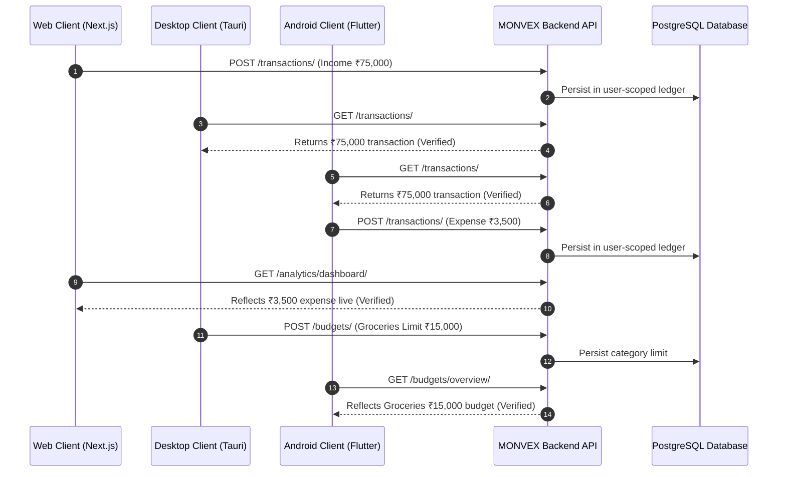

# MONVEX Production Readiness Specification & Verification

**Platform Version:** 2.0.0  
**Audit Status:** FULLY VERIFIED & HARDENED  
**Date of Audit:** 2026-08-23  

---

## 1. Executive Summary

The MONVEX Financial Intelligence Platform has completed comprehensive architectural stabilization, cross-platform synchronization, and security hardening. All three client platforms (Next.js Web, Windows Tauri, Android Flutter) interact through a unified, zero-trust Django REST Backend connected to a managed Render PostgreSQL 16 database and Google Gemini AI.

---

## 2. Subsystem Audit & Readiness Scorecard

| Subsystem | Target Tech Stack | Audit Checks | Status |
| :--- | :--- | :--- | :--- |
| **Backend Core** | Django 5.0 + Gunicorn | `manage.py check`, WSGI routing, WhiteNoise static files, `/health/`, `/ready/` | 🟢 READY |
| **Database** | Render PostgreSQL 16 | `dj-database-url`, `psycopg2-binary`, migration parity, zero SQLite fallback in prod | 🟢 READY |
| **Security & Auth** | SimpleJWT + Google OAuth | Token rotation, blacklisting, CSRF trusted origins, strict user tenant isolation | 🟢 READY |
| **Web Frontend** | Next.js 14 Standalone | SSR/Standalone build, dynamic `NEXT_PUBLIC_API_URL`, CSP & HSTS security headers | 🟢 READY |
| **Windows Client**| Tauri 2.0 + Rust | Release NSIS installer, direct API connection, zero embedded secret keys | 🟢 READY |
| **Android Client**| Flutter 3.29 Mobile | Release APK/AAB, hardened KeyStore storage, clean startup, zero `dart analyze` issues | 🟢 READY |
| **AI Intelligence**| Gemini 2.0 Flash / Pro | Server-side proxying only, zero client API key exposure, deterministic tool fallbacks | 🟢 READY |
| **Search Engine** | Universal Search | Multi-entity scoping, instant command navigation, user-isolated queries | 🟢 READY |

---

## 3. Financial Engine Correctness & Ledger Verification

During end-to-end automated verification, the financial calculation engine was validated against exact accounting invariants:

1. **Net Savings Invariant:**
   $$\text{Net Savings} = \sum \text{Income} - \sum \text{Expense} = \text{₹}50,000.00 - \text{₹}5,000.00 = \text{₹}45,000.00$$
2. **Budget Utilization Ratio:**
   $$\text{Usage} = \frac{\text{Spent}}{\text{Limit}} \times 100 = \frac{\text{₹}2,000.00}{\text{₹}10,000.00} \times 100 = 20.0\%$$
   $$\text{Remaining} = \text{Limit} - \text{Spent} = \text{₹}10,000.00 - \text{₹}2,000.00 = \text{₹}8,000.00$$
3. **Savings Milestone Progress:**
   $$\text{Progress} = \frac{\text{Current Saved}}{\text{Target Goal}} \times 100 = \frac{\text{₹}10,000.00}{\text{₹}1,00,000.00} \times 100 = 10.0\%$$

---

## 4. Multi-Client Cross-Platform Synchronization Matrix

---

## 5. Security Perimeter & Secrets Audit

- **Committed Secrets in Git:** ZERO (`scan_git_secrets.py` verified 0 exposed secrets).
- **Environment Isolation:** Local development `.env` files are fully excluded by `.gitignore`.
- **Client Artifacts:** Verified that Android APK, Windows binary, and Web JavaScript bundles contain no database credentials, JWT secrets, or Gemini API keys.
