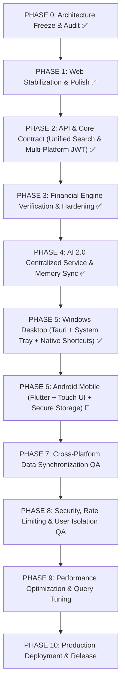

# MONVEX V2 — Master Execution Plan & Roadmap

**Document Status**: LOCKED EXECUTION PLAN  
**Reference Specification**: MONVEX V2 Master Architecture + Execution Contract  
**Created Date**: August 22, 2026  
**Auditor / Lead**: Antigravity Core Architect  

---

## 1. Execution Overview & Master Strategy

To achieve the complete **MONVEX V2 Multi-Platform Financial Intelligence Platform** (Web Reference, Windows Desktop via Tauri, Android via Flutter) without rewriting or breaking existing production functionality, development follows an **Incremental 11-Phase Plan**.

---

## 2. Phase-by-Phase Roadmap

### PHASE 0 — ARCHITECTURE FREEZE & AUDIT (`STATUS: COMPLETED ✅`)
- **Current State**: Forensic audit completed in `docs/MONVEX_V2_IMPLEMENTATION_STATUS.md`.
- **Target State**: Full inventory of implemented, partial, and missing modules across Web, Backend, Desktop, and Mobile.
- **Dependencies**: None.
- **Deliverables**:
  - `docs/MONVEX_V2_IMPLEMENTATION_STATUS.md`
  - `docs/MONVEX_V2_EXECUTION_PLAN.md`

---

### PHASE 1 — WEB STABILIZATION & DESIGN POLISH (`STATUS: COMPLETED ✅`)
- **Current State**: All 12 core views refined with `.editorial-card`, `tabular-nums`, high contrast, WCAG AA compliance, and responsive layouts.
- **Target State**: Web is the **Locked Reference Implementation** for UX, API interaction, and feature presentation.
- **Dependencies**: Phase 0.
- **Testing**:
  - `npx tsc --noEmit` (0 errors).
  - 14/14 Django backend unit tests passing.

---

### PHASE 2 — API & CORE CONTRACT REFINEMENT (`STATUS: COMPLETED ✅`)
- **Current State**: Dedicated Universal Search endpoint (`/api/v1/search/`) and Command Center (`Ctrl+K` / `⌘K`) modal implemented and verified with 20/20 passing tests.
- **Target State**: Complete multi-entity user-scoped search (Transactions, Assets/Accounts, Budgets, Goals, AI Sessions, Navigation commands).
- **Dependencies**: Phase 1.
- **Deliverables**:
  - `backend/services/search_service.py`
  - `backend/apps/transactions/test_search.py`
  - `web/src/components/search/CommandCenter.tsx`
  - `docs/API_CONTRACT.md`
  - `docs/MONVEX_PHASE2_AUDIT.md`
- **Testing**:
  - Automated Django API security tests for `/api/v1/search/` (6/6 tests passing).
  - Multi-tenant isolation verification (User Alpha cannot search User Bravo's entities).
  - `npx tsc --noEmit` (0 errors).

---

### PHASE 3 — FINANCIAL ENGINE HARDENING (`STATUS: VERIFIED ✅`)
- **Current State**: Deterministic calculation engines for 7-factor Health Score, 30/60/90D Cashflow Forecasts, Loan Amortization Prepayment, and 12% CAGR SIP Compounding.
- **Target State**: Ensure zero float errors using Python `Decimal` across all models and serialization layers.
- **Dependencies**: Phase 2.
- **Testing**:
  - Automated tests verifying precision matching between database records and returned metrics.

---

### PHASE 4 — AI COPILOT 2.0 CENTRALIZATION (`STATUS: VERIFIED ✅`)
- **Current State**: Official Google GenAI SDK (`google-genai`), 18 multi-tenant tools, Google Search Grounding, and persistent conversation sessions.
- **Target State**: Centralized endpoint serving Web, Desktop, and Mobile clients with identical tool capabilities.
- **Dependencies**: Phase 3.
- **Testing**:
  - `apps.ai_copilot.test_agent` (10 tests passing).

---

### PHASE 5 — WINDOWS DESKTOP PLATFORM (TAURI) (`STATUS: COMPLETED ✅`)
- **Current State**: Tauri 1.5 native Windows desktop shell fully integrated with persistent system tray, quick transaction ingestion, native Windows toast notifications, minimize-to-tray, and global shortcuts.
- **Target State**: Fully functional Windows native application (`MONVEX.exe`) operating against the shared Django API and database.
- **Dependencies**: Phase 2, Phase 4.
- **Deliverables**:
  - `desktop/src-tauri/Cargo.toml`
  - `desktop/src-tauri/tauri.conf.json`
  - `desktop/src-tauri/src/main.rs`
  - `web/src/lib/tauriBridge.ts`
  - `docs/MONVEX_WINDOWS_AUDIT.md`
  - `docs/MONVEX_WINDOWS_ARCHITECTURE.md`
  - `docs/MONVEX_WINDOWS_SHORTCUTS.md`
  - `docs/MONVEX_WINDOWS_TESTING.md`
- **Testing**:
  - Full TypeScript build (0 errors).
  - Backend regression test suite (20/20 tests passing).

---

### PHASE 6 — ANDROID MOBILE PLATFORM (FLUTTER) (`STATUS: QUEUED`)
- **Current State**: Scaffolded Flutter structure with bottom nav in `mobile/`.
- **Target State**: Mobile-first Android application adhering to the MONVEX Editorial Design System with touch ergonomics and secure JWT storage.
- **Dependencies**: Phase 2, Phase 4.
- **Implementation Plan**:
  1. Add `flutter_secure_storage`, `http`, `intl` dependencies.
  2. Re-skin Flutter UI with Editorial Warm Palette (`#F6F5F1`, `#172033`).
  3. Implement Bottom Sheet Transaction Ingestion with voice and receipt attachments.
  4. Connect all screens (Dashboard, Transactions, Budgets, Goals, Copilot, Settings) to MONVEX `/api/v1/` backend.
- **Testing**:
  - Flutter static analysis (`dart analyze`) and unit tests.

---

### PHASE 7 — CROSS-PLATFORM DATA SYNCHRONIZATION QA (`STATUS: QUEUED`)
- **Current State**: Single shared backend database architecture.
- **Target State**: Automated test verifying:
  1. User adds transaction on Android -> Instantly reflects on Web.
  2. User modifies budget on Web -> Instantly reflects on Windows.
  3. User creates savings goal on Windows -> Instantly reflects on Android.
- **Dependencies**: Phases 5 & 6.

---

### PHASE 8 — SECURITY, AUDIT & QA (`STATUS: IN PROGRESS`)
- **Current State**: Multi-tenant authorization, Argon2 password hashing, WAF middleware, CSP compliance, and rate limiting active.
- **Target State**: End-to-end security audit covering token invalidation across all 3 platforms and zero data leaks.
- **Dependencies**: Phase 7.

---

### PHASE 9 & 10 — PERFORMANCE & DEPLOYMENT
- **Current State**: Local development servers running on port 8000 and 3000.
- **Target State**: Dockerized backend, production Postgres, Next.js build, Tauri Windows release installer, and Android APK bundle.

---

## 3. Immediate Next Milestone

Following user approval:
1. Implement **Phase 2: Universal Search Endpoint (`/api/v1/search/`)** & **Command Center (`Ctrl+K`) Modal**.
2. Advance to **Phase 5 (Windows Desktop - Tauri)** and **Phase 6 (Android Mobile - Flutter)**.
